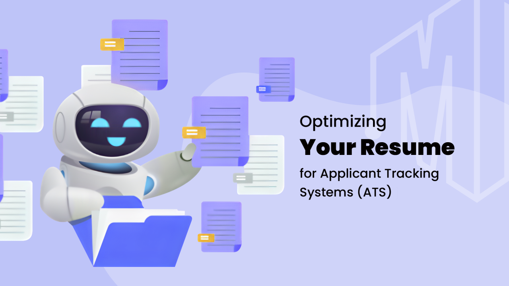

# ATS Tracking System for Resumes



## Project Overview

This project implements an **ATS Tracking System for Resumes** that uses AI to analyze and evaluate resumes against job descriptions. The system provides valuable insights into how well a resume matches a job description, highlighting key strengths and weaknesses, key points in resumes, and identifying missing keywords that could improve the resume's chances of passing through an Applicant Tracking System (ATS).

The system utilizes the **Gemini-1.5-Flash** generative AI model and is deployed using **Streamlit** on **Render**. Users can upload resumes and job descriptions, and the system will process the data to generate a professional evaluation, match percentage, missing keywords, and provide job-specific recommendations.

You can access the live application here: [ATS Tracking System for Resumes](https://resume-ats-tracking.onrender.com).

## Features
### The ATS System has below five buttons which provides the information of:
### 1. Tell Me About Resume
Once a user uploads their resume, the system provides an in-depth professional evaluation of the resume against the job description. It highlights the strengths and weaknesses of the applicant's profile relative to the job requirements.

### 2. Percentage Match
Based on the resume and job description, the system calculates a **percentage match**. It also identifies the missing keywords from the resume and provides final thoughts for improvement.

### 3. Keypoints in Resume
The system extracts key information from the resume, such as:
- **Technical Skills**
- **Soft Skills**
- **Education Details**
- **Experience/Project Information**

### 4. Match with Job Description
The system generates a table that illustrates the match between the resume and job description, highlighting the strengths and weaknesses in different areas.

### 5. Keywords Missing in Resume
The system identifies and suggests keywords or skills from the job description that are absent in the resume. It also recommends integrating these missing keywords into the resume for better ATS optimization.


## Technologies Used

- **Python**
- **Streamlit** for the frontend framework
- **Gemini-1.5-Flash** AI model for resume evaluation
- **Render** for deployment

## How It Works

1. **Upload Your Resume and Job Description**: Users can upload their resume and a job description (in **PDF** or **TXT** format) using the file upload section on the homepage.
2. **Processing**: Once the resume and job description are uploaded, the system processes the documents using NLP techniques to:
   - Categorize the resume
   - Extract key information
   - Calculate the match percentage
   - Identify missing keywords
3. **Display Results**: After processing, the system displays:
   - **Category of the Resume**
   - **Percentage Match with Job Description**
   - **Extracted Information** (Name, Phone Number, Email, Skills, Education)
   - **Missing Keywords** and suggestions for resume improvement

## Setup Instructions

### Prerequisites

Make sure you have the following software installed:
- **Python 3.x**
- **Streamlit** for the web framework
- **Gemini-1.5-Flash** AI model for evaluation (integrated via API or local model)
- **spaCy**, **transformers**, or other NLP libraries for text processing
- **Flask** for the backend server

### Local Installation

1. Clone the repository to your local machine:
    ```bash
    git clone https://github.com/yourusername/Resume-ATS-Tracking.git
    cd Resume-ATS-Tracking
    ```

2. Install the required libraries:
    ```bash
    pip install -r requirements.txt
    ```

3. Run the Streamlit application:
    ```bash
    streamlit run app.py
    ```

## Accessing the Deployed App

The application has been deployed on **Render**. You can access the live app here:  
[ATS Tracking System for Resumes](https://resume-ats-tracking.onrender.com).


## Acknowledgments

- Gemini-1.5-Flash for resume evaluation
- Streamlit for easy deployment and interaction
- Render for hosting the application
